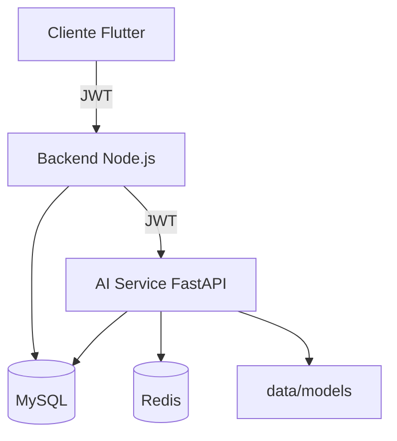

# Arquitetura da Inteligência Artificial — Plataforma VOD

Documento alinhado ao planejamento do projeto integrador PUC-Campinas ([ARQUITETURA_IA.md](https://github.com/) no repositório `streaming-vod-ai`). Este arquivo descreve o **desenho planejado** e o **status de implementação** no serviço `VOD-IA`.

---

## 1. Visão geral

O módulo de IA classifica gostos por usuário e gera recomendações personalizadas (RFIA01–RFIA04).

| Decisão | Planejado | Implementado em `VOD-IA` |
|---------|-----------|---------------------------|
| Modelo | Híbrido CB + CF (ALS) | `HybridRecommender` |
| API | FastAPI REST | `app/main.py` |
| Integração | Microserviço REST (backend em repo externo) | [INTEGRATION_BACKEND.md](./INTEGRATION_BACKEND.md) |
| Persistência | `.pkl` + Redis | `data/models/`, `app/core/cache.py` |
| Treino | Batch + perfil incremental | `scripts/train_offline.py`, `POST /profile/.../update` |
| Cold start | CB até 5 views (RFIA03) | `cold_start_threshold = 5` |

### Diagrama de componentes



---

## 2. Modelo de dados

### Tabelas (MySQL compartilhado)

| Tabela | ORM | Status |
|--------|-----|--------|
| `contents`, `categories`, `genres`, `content_*` | `schemas_db.py` | OK |
| `view_history` | `ViewHistory` | OK |
| `user_profiles_ai` | `UserProfileAI` | OK (`user_profiles_ai`) |
| `recommendation_events` | `RecommendationEvent` | OK + gravação em inferência |

### Rating implícito (Seção 2.2)

```
rating = clip(0.6·completion + 0.3·revisited + 0.1·finished, 0, 1)
```

Implementação: `app/utils/preprocessing.py` → `compute_implicit_rating`, usado em treino, inferência e atualização de perfil.

Interações com `rating >= 0.4` entram no ALS (`filter_positive_interactions`).

---

## 3. Modelos ML

### 3.1 Content-Based

| Requisito | Implementação |
|-----------|---------------|
| `text_doc` = título + descrição + gêneros/categorias | `build_text_doc()` com tokens repetidos 3× |
| TF-IDF n-grams (1,2), max_features=5000, min_df=2 | `ContentBasedRecommender.fit()` |
| Vetor de gosto = média ponderada por rating | `score_for_user()` |
| Similaridade cosseno | `cosine_similarity` |

### 3.2 Collaborative (ALS)

| Requisito | Implementação |
|-----------|---------------|
| ALS factors=64, reg=0.05, iter=20 | `CollaborativeRecommender` defaults |
| BM25 weighting | `bm25_weight()` antes do fit |
| `score_all` = user_factors @ item_factors.T | `score_all()` |
| Embeddings em `user_profiles_ai.embedding` | Sync no treino batch + update online |

### 3.3 Híbrido (RFIA03)

| Views | Estratégia interna | API `strategy` | Pesos CB/CF |
|-------|-------------------|----------------|-------------|
| &lt; 5 | `cold_start` | `content_based` | 100% / 0% |
| 5–19 | `transition` | `hybrid_weighted` | 60% / 40% |
| ≥ 20 | `mature` | `hybrid_weighted` | 30% / 70% |

Código: `app/models/hybrid.py`, mapeamento API: `to_api_strategy()`.

---

## 4. Estrutura de pastas

```
VOD-IA/
├── app/
│   ├── main.py
│   ├── api/routes/          # recommendations, profile, training, health, metrics
│   ├── core/                  # config, security, database, cache, middleware, metrics
│   ├── models/                # content_based, collaborative, hybrid, schemas_db
│   ├── services/
│   │   ├── feature_extractor.py   # ← planejado (antes só em scripts/)
│   │   ├── recommendation_service.py
│   │   ├── model_loader.py
│   │   └── profile_updater.py
│   ├── schemas/               # recommendation.py, interaction.py, profile, training
│   └── utils/
│       ├── preprocessing.py   # ← planejado
│       └── metrics.py
├── data/
│   ├── raw/                   # dumps MySQL (treino offline)
│   ├── processed/
│   └── models/                # content_based.pkl, als_model.pkl, metrics.json
├── notebooks/                 # Colab / exploração
├── scripts/
│   ├── train_offline.py
│   ├── evaluate.py
│   └── export_models.py
├── tests/
└── docs/                      # API, arquitetura, INTEGRATION_BACKEND.md
```

Backend Node.js: **repositório separado** — ver [INTEGRATION_BACKEND.md](./INTEGRATION_BACKEND.md).

---

## 5. Avaliação (RFIA01)

| Métrica | Alvo | Código |
|---------|------|--------|
| HitRate@10 | ≥ 0,70 | `scripts/evaluate.py`, `app/utils/metrics.py` |
| Precision/Recall/NDCG/MAP@k | — | `app/utils/metrics.py` |
| Split temporal 20% | — | `scripts/evaluation.split_interactions` |
| Usuários com ≥10 interações | — | `filter_users_min_interactions` |
| Baselines popularidade + aleatório | — | `scripts/evaluation.py` |

---

## 6. APIs

Prefixo: `/api/v1` (configurável via `API_PREFIX`).

| Endpoint planejado | Rota implementada | Auth |
|--------------------|---------------------|------|
| `GET /recommendations/{user_id}` | `GET /api/v1/recommendations/{user_id}` | JWT |
| `POST /profile/{user_id}/update` | `POST /api/v1/profile/{user_id}/update` | JWT |
| `POST /train` | `POST /api/v1/train` | `X-AI-API-Key` |
| — | `GET /health`, `GET /metrics` | — |

Detalhes e exemplos `curl`: [API.md](./API.md).

---

## 7. Mapeamento requisitos → código

| Requisito | Onde |
|-----------|------|
| RFIA01 (HitRate@10 ≥ 70%) | `scripts/evaluate.py` |
| RFIA02 (resposta ≤ 2s) | Redis cache TTL 3600s, inferência O(n) CB |
| RFIA03 (mín. 5 conteúdos) | `HybridRecommender._resolve_strategy` |
| RFIA04 (perfil incremental) | `profile_updater` α=0.2, invalidação cache |
| Seção 6 — classificar gostos | `user_profiles_ai.genre_weights` |
| Seção 7.4 — híbrido | `HybridRecommender` |
| Auditoria de recs | `recommendation_events` |

---

## 8. Observabilidade (extensão do deploy)

- Logs JSON: `request_id`, `user_id`, `latency_ms`
- Prometheus: `/metrics`
- OpenTelemetry: `OTEL_ENABLED=true`

Ver [MODEL_CARD.md](./MODEL_CARD.md) para limitações e ética.
